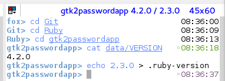

#### local

(A Fish / Fisherman theme)[http://fisherman.sh]
<br/>

## Install


```fish
⋊> fisher install https://github.com/carlosjhr64/theme-local
```

## Features

* Greeting from .greeting file in the working directory.

No greeting is given if .greeting is absent.

* Prompt from .prompt file in the working directory.

If .prompt is absent, defaults to "basename> ".

* Blue prompt on success, red on error.

* Short timestamp for right prompt.

* Right prompt is green when git is clean, red when dirty.

Additionally, it's magenta when there are untracked files, and yellow when git is out of sync.
And uses the default themes' symbols to mark the git status.
The right prompt is normal color when .git is absent.

* Title from .title file in the working directory.

Title defaults to basename when .title is absent.
The version number is appended to the title if data/VERSION is found.
Also appends the ruby version if .ruby-version file is found in the working directory.

## Screenshot

<p align="center">

</p>

# License

[MIT][mit] © [CarlosJHR64][author]


[mit]:            http://opensource.org/licenses/MIT
[author]:         http://github.com/carlosjhr64
